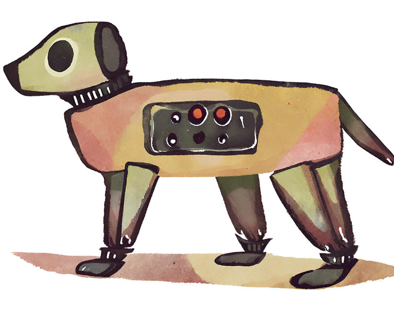

# Fidor

Reverse engineering the Unitree Go2 robot dog and adding obstacle avoidance features.

## Currently testing:
- Viam
- Velodyne VLP-16 and 32C Puck
- Voice commands with ChatGPT
- Image recognition and segmentation using Google MediaPipe
